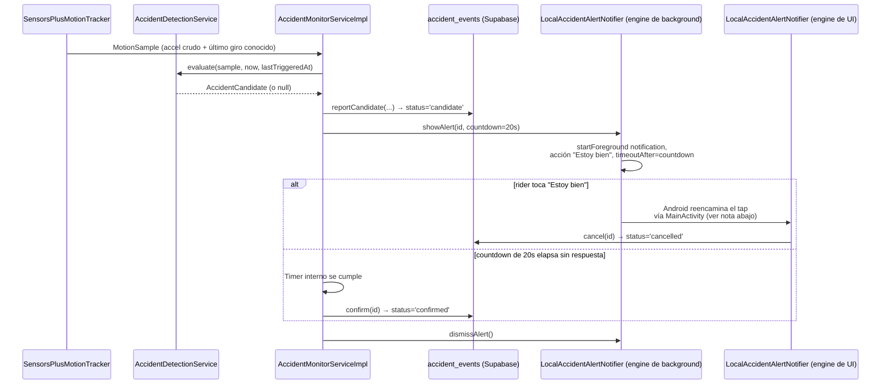

# Sentinel V2 — detección de accidentes (Fase 7)

Cómo Sentinel detecta un posible accidente a partir de los sensores de
movimiento del dispositivo, reporta un candidato, y le da al rider una
ventana para decir "estoy bien" antes de tratarlo como confirmado. Para el
servicio en background donde todo esto corre, ver
[docs/background_service.md](background_service.md); para el esquema de
`accident_events`, [docs/database.md](database.md).

## Qué NO es esta fase

Esta fase produce candidatos (`status='candidate'`) y los resuelve a
`cancelled` o `confirmed` — pura lógica cliente + RLS, sin backend propio.
**No** envía ninguna alerta a nadie (grupo, contactos de emergencia, push):
eso es la Fase 8 (alertas/Edge Function/push), explícitamente diferida. Un
evento `confirmed` hoy simplemente queda así en la base de datos, visible
para el propio rider y (una vez confirmado) para sus compañeros de sesión
vía la policy `accident_events_select_session_members_confirmed` ya
migrada — nada lo notifica todavía.

## Heurística de detección

`AccidentDetectionService` (dominio, puro, sin I/O) — un umbral simple, no
un modelo entrenado: si la magnitud del acelerómetro **crudo** (con
gravedad incluida, no el "user accelerometer" virtual de Android) se
desvía de los ~9.81 m/s² de reposo por más de `impactDeltaThresholdMps2`
(20 m/s² por defecto, ~2g), se considera un candidato. El giroscopio
(umbral `gyroThresholdRadS`, 4 rad/s por defecto) no es un gate —solo
sube o baja la `confidenceScore` del candidato— porque una frenada brusca
en línea recta es una desaceleración real sin rotación, y no debería
descartarse solo por eso. Un `cooldown` (60s por defecto) evita que el
ruido del sensor justo después de un impacto genere una ráfaga de
candidatos por el mismo evento físico.

Por qué acelerómetro **crudo** y no el virtual "linear acceleration" de
Android: ese sensor virtual pasa por el filtro propio de gravedad del
sistema operativo, que añade latencia y es una caja negra imposible de
testear unitariamente. Trabajar desde el crudo y restar la gravedad
nosotros mismos es más simple, más testeable (ver
`test/features/accidents/domain/services/accident_detection_service_test.dart`,
11 casos) y — crucial para esta fase — es lo que permite inyectar valores
exactos vía `adb emu sensor set acceleration x:y:z` en el emulador y
verificar el resultado, en vez de depender del comportamiento del filtro
del SO.

**Umbrales no calibrados**: los valores por defecto son un punto de
partida razonable, no el resultado de analizar datos reales de impactos
de motociclistas vs. baches/grava/frenadas de emergencia. Calibrarlos de
verdad necesitaría trazas de acelerómetro reales, fuera del alcance de
esta fase.

## Flujo completo

## El descubrimiento importante de esta fase: dos registros, no uno

El diseño original asumía que, como el engine de background de la Fase 6
(`rideBackgroundMain`) vive mientras `RideBackgroundService` corre, bastaba
con inicializar `flutter_local_notifications` **ahí** y registrar el
callback de "Estoy bien" en ese mismo engine — igual que `showAlert()` ya
corre ahí sin problema.

**Verificado en vivo en el emulador que esto es falso.** Al tocar la
acción "Estoy bien" de una notificación real, Android reencamina el tap a
través de la Activity principal de la app (`logcat` mostró
`ActivityTaskManager: START ... act=SELECT_NOTIFICATION ...
cmp=com.sentinel.app/.MainActivity`), sin importar en qué engine se llamó
`initialize()`. Un callback registrado solo en el engine de background
nunca se disparaba — confirmado repitiendo la prueba con un `print` de
diagnóstico dentro de `onDidReceiveNotificationResponse`.

**Arreglo**: `initializeAccidentAlertResponseHandling()`
(`lib/features/accidents/accident_alert_response.dart`) registra un
*segundo*, independiente `LocalAccidentAlertNotifier` en el engine de
**UI** (llamado desde `bootstrap()`), cuyo único trabajo es llamar
`AccidentEventRepository.cancel(id)` directo contra Supabase — sin tocar
nada del estado en memoria del engine de background (el timer de
countdown, `_pendingAccidentEventId`), porque ese engine no tiene
ninguna referencia a esa otra isolate. Si el timer del engine de
background igual dispara `confirm(id)` después de que este ya canceló la
fila, la propia policy RLS (`accident_events_update_self_while_candidate`,
que exige `status='candidate'`) hace que ese `UPDATE` no afecte ninguna
fila — no hay condición de carrera real, solo una escritura de más que
Postgres descarta silenciosamente.

El engine de background **sigue** llamando su propio
`initialize()`/`showAlert()`/`dismissAlert()` — eso es lo que efectivamente
muestra la notificación y corre el countdown; solo dejó de esperar recibir
la respuesta del tap.

## Qué se verificó en vivo (emulador, no solo tests)

Con `adb emu sensor set acceleration ...` para inyectar un impacto real
(no un mock) contra un dispositivo genuinamente corriendo la app:

1. Impacto inyectado → fila `candidate` real en `accident_events`, con
   `impact_mps2`/`g_force`/`confidence_score` calculados correctamente
   desde la lectura inyectada.
2. Notificación persistente mostrada (`dumpsys notification`: canal
   `accident_alerts`, `actions=1`).
3. Countdown sin respuesta → auto-confirma (`status='confirmed'`,
   `confirmed_at` poblado ~20s/90s/300s/600s después según la config usada
   en cada prueba) y la notificación se retira.
4. El fix de doble-registro descrito arriba: confirmado que el tap SÍ
   llega al engine de UI (`onDidReceiveNotificationResponse` se disparó
   con el `payload` correcto) una vez añadido ese segundo registro — antes
   del fix, no llegaba a ningún lado con un callback capaz de actuar.

**No verificado por tap manual en esta sesión**: el camino completo
"tocar el botón 'Estoy bien' exacto → `actionId` coincide → `cancel()`
se ejecuta" — el botón (`content-desc="Estoy bien"`, confirmado que existe
con `uiautomator dump`) resultó difícil de acertar de forma confiable a
través de varias rondas de `adb shell input tap` sobre una sombra de
notificaciones que se anima/colapsa entre comandos; no es una duda sobre
el código sino una limitación de esta forma de automatizar el gesto. Esa
lógica específica (`_handleConfirmedOk` ignora IDs obsoletos, cancela en
vez de confirmar, cancela el timer) sí está cubierta por tests unitarios
con fakes en
`test/features/accidents/data/repositories/accident_monitor_service_impl_test.dart`,
incluyendo el caso exacto "tapping 'Estoy bien' before the countdown
elapses cancels, not confirms".

## Deuda técnica

- **Sin latitud/longitud en el candidato reportado**: `AccidentMonitorServiceImpl`
  deliberadamente no depende de `rides`' `LocationTracker` (evita una
  dependencia cruzada de features a nivel de capa de datos — ver el doc
  comment de la clase). `session_id` permite correlacionar con
  `live_locations`/`location_history` de ese mismo usuario+sesión para
  ubicar al rider; una fase futura (posiblemente la Fase 8, al construir
  la alerta) podría hacer ese cruce del lado del servidor.
- **`AccidentMonitorService.start()` no reintenta si `MotionTracker.isAvailable()`
  da `false` una vez**: se rinde para toda la sesión en vez de reintentar
  periódicamente. Aceptable: un dispositivo sin acelerómetro no va a
  adquirir uno a mitad del viaje.
- **Sin persistencia de `_pendingAccidentEventId`/countdown a través de un
  kill del proceso**: si `RideBackgroundService` muere y `START_STICKY` lo
  reinicia (ver deuda técnica de Fase 6), cualquier candidato con
  countdown en curso queda huérfano en `status='candidate'` para siempre
  — nadie vuelve a resolverlo. Mismo tipo de hueco que el de Fase 6 con
  `sessionId`, mismo argumento de por qué no se cerró aquí (ventana de
  riesgo pequeña, foreground service ya protege del caso común).
- **Notificación de countdown sin una cuenta regresiva visible en vivo**:
  el texto dice "no respondes en 20 segundos" una sola vez al mostrarse;
  no se actualiza número a número. `timeoutAfter` hace que la notificación
  desaparezca sola al expirar, pero no muestra el tiempo restante
  descendiendo.
