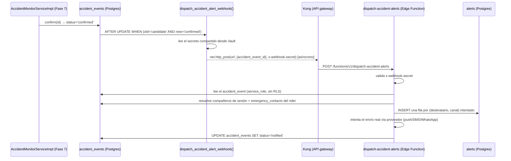

# Sentinel V2 — despacho de alertas (Fase 8)

Qué pasa después de que un `accident_event` llega a `confirmed` (Fase 7,
[docs/accident_detection.md](accident_detection.md)): quién se entera,
por qué canal, y qué queda registrado. Para el esquema de `alerts` /
`device_push_tokens`, [docs/database.md](database.md).

## Qué NO es esta fase

Esta fase decide **a quién avisar y lo intenta**, y dispara el traslado a
`status='notified'`. No implementa el registro real de `device_push_tokens`
desde el cliente Flutter (requiere un proyecto Firebase real, fuera del
alcance de este entorno de desarrollo — ver deuda técnica) ni credenciales
reales de FCM/Twilio/Meta WhatsApp (tampoco disponibles aquí). El pipeline
entero —
trigger, Edge Function, resolución de destinatarios, escritura de
`alerts`, transición de estado — es real y está verificado en vivo; lo que
no está verificado es la entrega final a un dispositivo/teléfono real, y
eso se documenta explícitamente más abajo, no se disimula.

## Por qué un trigger de base de datos, no una llamada desde el cliente

`AccidentMonitorServiceImpl` (Fase 7) es quien mueve un `accident_event` a
`confirmed`, pero **no** es quien despacha la alerta directamente. Dos
razones:

1. **Robustez ante el hueco que ya documentó la Fase 7**: si
   `RideBackgroundService` muere justo cuando el countdown expira, un
   cliente que dependiera de "llamar a la Edge Function después de
   confirmar" perdería la alerta junto con el proceso. Un trigger de base
   de datos reacciona al **estado de la fila**, no a que un proceso
   cliente específico siga vivo.
2. **`alerts` es, por diseño desde la Fase 2/migración 008, una tabla sin
   ninguna policy de cliente** — ni `service_role` está expuesto al bundle
   Flutter (`docs/security.md` principio 2). Solo algo que corra con la
   `service_role` key puede escribir ahí, y eso solo puede ser una Edge
   Function.

## Flujo completo



`net.http_post` (extensión `pg_net`) es **asíncrono**: la transacción del
trigger encola la petición HTTP y sigue de inmediato — el `UPDATE` que
confirma el accidente nunca espera a que la Edge Function responda.

## Por qué un trigger propio y no `supabase_functions.http_request()`

El generador de "Database Webhooks" del Dashboard de Supabase crea
triggers usando la función incorporada `supabase_functions.http_request()`
— pero sus argumentos (URL, método, headers) son **literales fijos** en el
propio `CREATE TRIGGER`, evaluados una sola vez al crear el trigger. Como
el header con el secreto compartido tiene que ser un valor real para que
la Edge Function lo acepte, usar esa función habría significado escribir
el secreto directamente en un archivo de migración — versionado en git.

`dispatch_accident_alert_webhook()` (función propia, en
`20260828000001_accident_alert_dispatch.sql`) hace lo mismo pero lee el
secreto desde `vault.decrypted_secrets` **en el momento de cada llamada**,
así que la migración en sí no contiene ningún valor sensible — solo el
*nombre* del secreto (`accident_alert_webhook_secret`), igual que
`config/dev.json.example` en Flutter nunca contiene una key real (README
§4).

## Resolución de destinatarios

`dispatch-accident-alerts/index.ts` resuelve dos grupos, cada uno con su
propia regla — nada implícito:

- **Compañeros de sesión** (`ride_session_members` activos de la misma
  `session_id`, excluyendo al propio rider): push a cada
  `device_push_tokens` habilitado que tengan; si un compañero no tiene
  ningún token push habilitado pero sí un `phone` en su `profiles` (visible
  entre compañeros de grupo desde la Fase 1 — ver `docs/database.md`), cae
  a SMS como respaldo. WhatsApp es **independiente** de push/SMS: se
  intenta además, sin importar si push ya lo alcanzó, si
  `profiles.whatsapp_alerts_opt_in = true` y tiene teléfono — la redundancia
  es deseable en una alerta de accidente. Sin push, sin WhatsApp y sin
  teléfono → no hay nada que intentar, no se escribe fila.
- **`emergency_contacts` del rider afectado**: se respeta `notify_push`,
  `notify_sms` y `notify_whatsapp` de forma independiente y literal por
  contacto — un contacto con `notify_push=true` pero sin `contact_user_id`
  (no tiene cuenta Sentinel) simplemente no recibe push, y uno con
  `notify_whatsapp=false` nunca recibe WhatsApp aunque tenga teléfono, sin
  excepciones ni sustitutos inferidos.

Cada intento (una fila por destinatario+canal, y una fila por *token* si un
destinatario tiene varios dispositivos push) se registra en `alerts` con
`status='sent'`/`'failed'` según lo que respondió el proveedor —
`accident_events.status='notified'` significa "se intentó despachar",
no "todos confirmaron recepción"; ver deuda técnica.

### Por qué WhatsApp necesita su propia columna de consentimiento

A diferencia de push/SMS, un mensaje de WhatsApp iniciado por el "negocio"
(una alerta siempre lo es — nunca es una respuesta a algo que el
destinatario escribió primero) tiene que:

1. Usar una **plantilla pre-aprobada** por Meta, no texto libre — no se le
   puede simplemente "escribir" al proveedor como con SMS. La plantilla
   ("accident_alert", categoría *Utility*) tiene que decir exactamente lo
   mismo que compone `buildAlertMessage`, en 3 parámetros ordenados —
   `buildWhatsAppTemplateParams` en `message.ts` arma esos 3 valores; el
   texto exacto a registrar en Meta está documentado ahí mismo.
2. Tener el **consentimiento explícito** del destinatario para recibir
   mensajes de ese número de negocio — a diferencia de SMS, donde cualquier
   número es válido de entrada.

Por eso `notify_whatsapp` (en `emergency_contacts`) y
`whatsapp_alerts_opt_in` (en `profiles`, para compañeros de grupo/sesión)
son columnas nuevas y deliberadamente separadas de `notify_push`/
`notify_sms` — nunca se infiere consentimiento de WhatsApp a partir de esos
otros dos, ni de que el teléfono ya sea visible entre compañeros de grupo
(Fase 1). En la app, esto se traduce en un checkbox propio ("acepto recibir
alertas de Sentinel por WhatsApp") al cargar el teléfono propio o el de un
contacto de emergencia — pendiente de UI, ver deuda técnica.

## Idempotencia

Dos guardas, ambas en `dispatchAlertsFor()`:

1. Si el `accident_event` ya no está en `status='confirmed'` (todavía
   `'candidate'`, o ya `'notified'`/`'resolved'` de una ejecución previa),
   la función no hace nada. Esto cubre tanto una llamada prematura como una
   repetida.
2. Si ya existe alguna fila en `alerts` para ese `accident_id`, tampoco
   despacha de nuevo — verificado en vivo (ver abajo) que una segunda
   invocación manual para el mismo accidente no duplica filas.

No hay lock distribuido — ver deuda técnica.

## Proveedores: reales, pero sin credenciales en este entorno

`providers.ts` resuelve un proveedor real por canal, cada uno leyendo sus
credenciales de variables de entorno (`supabase/functions/.env`, plantilla
en `.env.example`):

- **Push**: `FcmPushProvider` vía FCM HTTP v1, con firma JWT de cuenta de
  servicio propia en `fcm.ts` (`crypto.subtle` de Deno, sin SDK de Google).
- **SMS**: `TwilioSmsProvider` vía la API REST de Twilio.
- **WhatsApp**: `MetaWhatsAppProvider` vía WhatsApp Cloud API (`whatsapp.ts`)
  — manda la plantilla `accident_alert` con los 3 parámetros de
  `buildWhatsAppTemplateParams`, no texto libre (ver arriba).

Ninguna de las tres tiene credenciales configuradas en este proyecto local
— no existe un proyecto Firebase, cuenta Twilio, ni app de Meta Developer
para este desarrollo — así que las tres resuelven a un `Noop*Provider` que
**igual** escribe la fila `alerts` (con `status='failed'` y un `error`
específico como `whatsapp_provider_not_configured`) en vez de fallar en
silencio o saltar el intento. Mismo patrón que `MotionTracker.isAvailable()`
en la Fase 7: degradar con una señal clara, no fingir que no hace falta.

## Qué se verificó en vivo (Supabase local real, no solo tests)

Con el stack local completo (`npx supabase start`, edge runtime
levantado) y el secreto de Vault configurado (ver "cómo verificar" abajo):

1. **El trigger dispara solo**: al hacer
   `UPDATE accident_events SET status='confirmed' WHERE id=...` directo en
   `psql` (sin invocar la función a mano), el `accident_event` terminó en
   `status='notified'` y aparecieron filas reales en `alerts` — el camino
   completo trigger → `pg_net` → Kong → Edge Function corrió sin que nada
   del lado cliente lo iniciara.
2. **Resolución de destinatarios correcta con los fixtures de
   `seed.sql`**: confirmar el accidente `ffffffff-…` (candidato de rider1,
   quien sí tiene `emergency_contacts` sembrados) produjo exactamente 7
   filas — rider2 (compañero de sesión) por push únicamente (no opta a
   WhatsApp); rider3 (compañero de sesión) por push **y** WhatsApp a la vez
   (tiene token push, `whatsapp_alerts_opt_in=true` y teléfono — prueba que
   ambos canales se intentan de forma independiente, no exclusiva);
   rider2-como-contacto-de-emergencia por push, SMS **y** WhatsApp (los
   tres `notify_*` en `true`); y María (contacto solo-teléfono) por SMS
   únicamente, sin WhatsApp — su `notify_whatsapp=false` se respetó aunque
   sí tiene teléfono, probando que el flag nunca se infiere. Confirmar
   `dddddddd-…` (candidato de rider2, sin `emergency_contacts` propios)
   produjo exactamente 3 filas — rider1 por push, rider3 de nuevo por push
   y WhatsApp — mismo resultado consistente para rider3 en un accidente
   distinto.
3. **Guarda de autenticación**: una petición sin `x-webhook-secret` o con
   uno incorrecto devuelve `401` sin tocar la base de datos.
4. **Idempotencia**: invocar la función dos veces para el mismo accidente
   ya `confirmed` no duplicó filas en `alerts` (segunda respuesta:
   `{"reason":"already_dispatched", "recipients":0}`).
5. **Degradación sin secreto en Vault**: con el secreto borrado a
   propósito, confirmar un accidente **no falló** — el `UPDATE` se
   completó con un `WARNING` en el log de Postgres, sin ningún trigger de
   HTTP disparado (verificado con `raise warning` visible en la salida de
   `psql`, y que la fila quedó en `confirmed`, no `notified`, hasta
   restaurar el secreto).
6. `npx supabase test db`: 31/31 (24 base + 7 de
   `031_accident_alert_dispatch.sql`: `pg_net` instalado, el trigger
   existe, `alerts` sigue sin ninguna policy de cliente, `alert_channel`
   incluye `whatsapp`, y existen `emergency_contacts.notify_whatsapp` +
   `profiles.whatsapp_alerts_opt_in`).
7. `deno lint`/`deno check`/`deno test` (vía `npx deno`, ya que el host de
   desarrollo no tiene Deno instalado — ver más abajo) limpios sobre las 7
   archivos TypeScript de la función, incluidos los 2 tests nuevos de
   `buildWhatsAppTemplateParams`.

**No verificado**: un envío real llegando a un teléfono/dispositivo (sin
credenciales de FCM/Twilio/Meta en este entorno — ver deuda técnica), y el
registro real de `device_push_tokens` desde la app Android (sin proyecto
Firebase — también deuda técnica). El código de los tres proveedores está
escrito para funcionar contra las APIs reales (FCM HTTP v1 con JWT firmado,
API REST de Twilio con Basic Auth, WhatsApp Cloud API con plantilla) pero
ese último-kilómetro específico no se pudo ejercitar de punta a punta.

## Cómo verificar (o reconfigurar) localmente

El secreto compartido es la única pieza que **no** vive en una migración —
ver "por qué un trigger propio" arriba. Configurarlo (una vez por entorno,
no lo hace `db reset`):

```powershell
# 1. Generar un valor y copiarlo a supabase/functions/.env (plantilla:
#    supabase/functions/.env.example) como ACCIDENT_ALERT_WEBHOOK_SECRET=<valor>

# 2. Insertar EL MISMO valor en Vault (el trigger lo lee de ahí):
docker exec supabase_db_sentinel psql -U postgres -d postgres -c "select vault.create_secret('<mismo-valor>', 'accident_alert_webhook_secret', 'dispatch-accident-alerts webhook auth');"

# 3. Reiniciar para que el edge runtime cargue supabase/functions/.env:
npx supabase stop
npx supabase start
```

Luego, para forzar el flujo completo sobre los fixtures de `seed.sql`:

```powershell
docker exec supabase_db_sentinel psql -U postgres -d postgres -c "update public.accident_events set status='confirmed', confirmed_at=now() where id='ffffffff-ffff-ffff-ffff-ffffffffffff';"
docker exec supabase_db_sentinel psql -U postgres -d postgres -c "select recipient_type, channel, status from public.alerts where accident_id='ffffffff-ffff-ffff-ffff-ffffffffffff';"
```

`npx supabase db reset` deshace esto (vuelve el fixture a `'candidate'` y
borra el secreto de Vault, que no es parte de ninguna migración) — repetir
los 3 pasos de arriba después de cualquier reset.

Tests de TypeScript (`message_test.ts`, puro, sin red/Supabase):

```powershell
cd supabase/functions/dispatch-accident-alerts
npx -y deno test message_test.ts
npx -y deno lint .
```

## Deuda técnica

- **Sin credenciales reales de proveedor** (ver arriba): requiere crear un
  proyecto Firebase real (para `FCM_SERVICE_ACCOUNT_JSON`), una cuenta
  Twilio (para `TWILIO_*`) y una app de Meta Developer con WhatsApp
  configurado (para `META_WHATSAPP_*`, incluida la plantilla
  `accident_alert` aprobada) — ninguno de los tres existe en este entorno
  de desarrollo. El código de los tres proveedores está completo y se
  ejecuta (falla limpiamente por falta de credenciales, no por un bug),
  pero un envío real end-to-end queda pendiente de esa configuración
  externa.
- ~~**Sin UI para el consentimiento de WhatsApp**~~ — resuelto: `profile` y
  `emergency_contacts` ahora exponen el checkbox de `whatsapp_alerts_opt_in`
  / `notify_whatsapp` (switch "Alertas de accidente por WhatsApp" /
  "Notificar por WhatsApp"), con el mismo flujo de guardado que los demás
  campos de cada pantalla. Ver `docs/architecture.md`.
- **`device_push_tokens` se escribe, pero nunca con un token real todavía**:
  el lado Supabase está completo y probado —
  `DevicePushTokenRepository`/`PushTokenRegistrar`
  (`lib/features/push_tokens/`) registran/re-registran un token en cuanto
  cambia la sesión o el proveedor lo rota. Lo que falta es el proveedor: la
  única implementación de `PushTokenSource` hoy es
  `UnavailablePushTokenSource`, que nunca produce un token, porque cablear
  `firebase_messaging` de verdad requiere un `google-services.json` de un
  proyecto Firebase real — sin ese archivo, el plugin Gradle
  `com.google.gms.google-services` rompe `flutter build apk`/`flutter run
  -d <android>` para todo el repo, no solo para esta función (no es un
  fallback silencioso en runtime, es un build roto). Mismo proyecto
  Firebase pendiente que arriba (`FCM_SERVICE_ACCOUNT_JSON`). El día que
  exista, solo hace falta una `FirebaseMessagingPushTokenSource` que
  implemente `PushTokenSource` — nada más en `push_tokens/` cambia.
- **`status='notified'` es "se intentó", no "se entregó"**: si los 5
  intentos de una alerta fallan (proveedor caído, token inválido), el
  accidente igual queda `'notified'` — no hay reintento ni escalamiento
  a un canal alternativo si el primero falla. Cada fila de `alerts` sí
  registra su propio éxito/fracaso para auditoría, pero nada actúa sobre
  un fallo automáticamente.
- **Idempotencia sin lock distribuido**: la guarda #2 (arriba) es un
  `SELECT` seguido de `INSERT`s, no una transacción con lock — dos
  invocaciones concurrentes para el mismo accidente (no debería ocurrir en
  la práctica: el trigger solo dispara una vez por transición, y este
  pipeline es el único llamador) podrían en teoría intercalarse. Riesgo
  aceptado por la misma razón que otros gaps de concurrencia de fases
  anteriores: la ventana real es mínima y el costo de un lock explícito no
  se justifica todavía.
- **Sin retención/purga de `alerts`**: crece indefinidamente, igual que
  `location_history` (ver `docs/database.md`).
