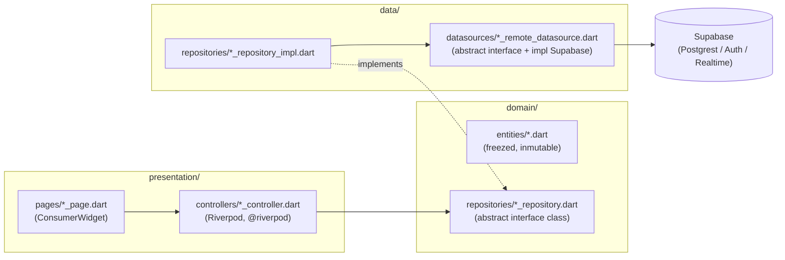

# Sentinel V2 — arquitectura Flutter

Cómo está organizado el código Dart/Flutter y las convenciones que sigue
cada feature nueva. Para el modelo de datos/Postgres ver
[docs/database.md](database.md); para seguridad y privacidad,
[docs/security.md](security.md); para el uso de Supabase Realtime
(canales, ciclo de vida de suscripción, reconexión),
[docs/realtime.md](realtime.md); para el servicio en background de
Android (Fase 6, `RideBackgroundService`),
[docs/background_service.md](background_service.md); para la detección
de accidentes (Fase 7), [docs/accident_detection.md](accident_detection.md);
para el envío de alertas (Fase 8, Edge Function + push/SMS),
[docs/alerts.md](alerts.md); para historial y estadísticas básicas
(Fase 9), [docs/history.md](history.md); para el dashboard responsive de
Web (Fase 10), [docs/web_dashboard.md](web_dashboard.md).

## Capas por feature

Cada feature bajo `lib/features/<nombre>/` sigue `data` → `domain` →
`presentation`, pero **solo se crean las carpetas que ya tienen contenido
real** — nunca una estructura completa "por si acaso". Dos subcarpetas
opcionales, introducidas recién en `rides/` (Fase 5) porque hasta ahora
ninguna feature las había necesitado:

- **`domain/services/`** — lógica de negocio pura que no encaja como método
  de una entidad ni como repositorio (no habla con datos externos):
  `MemberTrackingService`, `StragglerDetectionStrategy`,
  `LocationSamplingPolicy`. Se testean como funciones puras, sin fakes ni
  `ProviderContainer`.
- **`presentation/utils/`** — funciones puras de mapeo hacia un widget de
  terceros que no justifica una interfaz de dominio propia
  (`member_markers.dart` construye `Set<Marker>` de `google_maps_flutter`
  a partir de `List<MemberLocation>`). Ver la nota en ese archivo sobre por
  qué esto no se convirtió en un `MapRepository`.

**Regla dura: la UI nunca llama a `supabase_flutter` directamente.** Cada
integración externa (Supabase, `geolocator`, `sensors_plus`, plugins
Android) pasa por una interfaz de dominio (`abstract interface class`) con
una implementación concreta detrás — así:

- la capa de presentación y los tests de controller/widget usan **fakes**
  en memoria, sin red ni Supabase local corriendo;
- cambiar de backend o de plugin (p. ej. reemplazar `geolocator` en Android
  por un `BackgroundRideService` propio en la Fase 6) no toca la UI.

Ejemplo ya implementado (`features/auth/`, `features/profile/`):

| Capa | Archivo | Responsabilidad |
|---|---|---|
| domain | `entities/profile.dart` | modelo inmutable (`freezed`), `fromJson`/`toJson` con `fieldRename: FieldRename.snake` |
| domain | `repositories/profile_repository.dart` | contrato `abstract interface class`, sin saber que existe Postgres |
| data | `datasources/profile_remote_datasource.dart` | única clase que importa `supabase_flutter`; retorna `Map<String, dynamic>` crudo |
| data | `repositories/profile_repository_impl.dart` | mapea `Map` → entidad, traduce `PostgrestException` a [`DataException`](../lib/core/errors/app_exception.dart) |
| presentation | `controllers/profile_controller.dart` | providers Riverpod (`@riverpod`/`@Riverpod(keepAlive: true)`); el estado del controller (`AsyncValue<void>`) es solo el resultado de la *acción* (guardar), no los datos — esos se leen de un provider de solo-lectura aparte (`currentProfileProvider`) |
| presentation | `pages/profile_page.dart` | `ConsumerWidget`/`ConsumerStatefulWidget`, nunca importa `supabase_flutter` |

## Composición entre features

La capa de **dominio** de una feature nunca importa otra feature. La capa
de **presentación** sí puede — `features/groups/presentation/pages/group_detail_page.dart`
importa `features/rides/presentation/controllers/ride_sessions_controller.dart`
(`activeSessionProvider`) para mostrar el estado del viaje del grupo
("Iniciar viaje"/"Ver viaje en curso") directamente en el detalle del
grupo. Esto es deliberado, no una dependencia circular accidental: una
sesión de viaje pertenece conceptualmente a un grupo, así que mostrarla ahí
es composición de UI normal en una arquitectura feature-first. La regla es
solo de dirección: `rides` puede depender de `groups` (usa
`groupMembersProvider` para saber si el usuario es admin), y `groups`
puede depender de `rides` para este único widget — pero ninguna de las dos
depende de `profile`/`vehicles`/`emergency_contacts`, ni viceversa, porque
no hay necesidad real de mostrarlos juntos todavía. Si esto empieza a
crecer sin límite entre muchas features, es señal de extraer lo compartido
a `shared/` en vez de seguir enlazando features entre sí.

## Manejo de errores

Un único árbol sellado, `AppException` (`lib/core/errors/app_exception.dart`):

- `ConfigurationException` — falta configuración de arranque.
- `AuthException` — fallos de autenticación (con traducción de códigos de
  Supabase a mensajes en español).
- `DataException` — fallos de lectura/escritura en features CRUD simples
  sobre una tabla protegida por RLS (perfil, vehículos, contactos de
  emergencia...). Se comparte entre features en vez de crear una subclase
  por feature porque, para un `select`/`update`/`insert` contra una sola
  tabla, el modo de fallo y su traducción son idénticos — solo cambia el
  mensaje. Una feature cuyos fallos tengan significado de dominio real
  (grupos: "código de invitación inválido", "el owner no puede
  abandonar") debe seguir obteniendo su propio tipo cuando llegue.

Cada `*RepositoryImpl` atrapa la excepción de bajo nivel (`PostgrestException`,
`AuthException` de Supabase) y la traduce — la presentación solo maneja
`AppException`.

## Estado y proveedores (Riverpod)

- `riverpod_generator` (`@riverpod` / `@Riverpod(keepAlive: true)`) en vez
  de providers escritos a mano, salvo el caso especial de
  `appConfigProvider` (valor inyectado en `bootstrap()` antes de que exista
  el árbol de providers, ver `core/config/app_config.dart`).
- **`keepAlive: true`** para lo que debe sobrevivir a que la última pantalla
  que lo usa se cierre: repositorios (`authRepositoryProvider`,
  `profileRepositoryProvider`, ...) y el estado de sesión
  (`authStateChangesProvider`). El resto usa el auto-dispose por defecto de
  Riverpod 3.
- **Provider `keepAlive` cuyo *valor* no le importa a nadie, solo su efecto
  secundario**: `pushTokenRegistrationProvider`
  (`features/push_tokens/presentation/controllers/push_token_providers.dart`)
  es un `Stream<void>` que reacciona a cada cambio de sesión reenviando el
  push token del dispositivo (`PushTokenRegistrar`) — `SentinelApp` hace
  `ref.watch(pushTokenRegistrationProvider)` sin usar el `AsyncValue`
  resultante, únicamente para mantenerlo vivo durante toda la app. Mismo
  idioma que `ref.watch(goRouterProvider)`, aplicado a un provider sin UI
  propia en vez de a uno con estado visible.
- **Patrón lectura/escritura separados**: un provider `Future<T>` de solo
  lectura (p. ej. `currentProfileProvider`) más un `Notifier` cuyo estado es
  únicamente `AsyncValue<void>` sobre la última acción (p. ej.
  `ProfileController.save`). El notifier invalida el provider de lectura al
  terminar (`ref.invalidate(currentProfileProvider)`) en vez de mantener él
  mismo una copia de los datos — una sola fuente de verdad. **El mismo
  patrón se aplica a listas** (`vehiclesProvider`/`VehicleFormController`,
  `emergencyContactsProvider`/`EmergencyContactFormController`): el
  provider de lectura expone `Future<List<T>>` completo (no hay
  paginación todavía — listas de usuario pequeñas, no lo justifican aún), y
  el `*FormController` centraliza create/update/delete, invalidando la
  lista tras cada mutación exitosa. Se evaluó (y se descartó) mantener el
  estado de la lista directamente en un único `AsyncNotifier<List<T>>` con
  edición local optimista — más rápido de percibir, pero reintroduce lógica
  de "parchear la lista a mano" por cada mutación y dos formas distintas de
  manejar acciones dentro del mismo código base; se prefirió consistencia
  con el patrón ya usado en Profile.
- **Nombres de métodos en un `@riverpod class`**: evitar `update` como
  nombre de método propio — `AsyncNotifier`/`Notifier` ya exponen un
  `update(cb)` heredado con firma distinta, y reutilizar el nombre produce
  un `invalid_override` en tiempo de análisis, no en runtime. Se usan
  nombres explícitos (`updateVehicle`, `updateContact`) en su lugar.
- **Trampa conocida de Riverpod 3 en tests con `ProviderContainer` puro**:
  `container.read(streamProvider.future)` puede quedarse esperando
  indefinidamente si nada mantiene vivo al provider durante el `await` — en
  la app real esto no pasa (el widget que hace `ref.watch(...)` ya lo
  mantiene vivo), pero en un test con `ProviderContainer` a secas hace falta
  `container.listen(provider, (_, __) {})` antes de leer `.future`. Ver
  `test/features/profile/presentation/controllers/profile_controller_test.dart`.
- **La misma trampa existe del lado de la escritura, y ahí sí se manifestó
  en la app real**: `AuthController.signOut()` (llamado sin que nada
  observe/escuche `authControllerProvider`, a diferencia de
  `signIn`/`signUp` — ver el `ref.watch`/`ref.listen` que `LoginPage`/
  `RegisterPage` ya hacen sobre sí mismos) podía autodesecharse a mitad del
  `await` y lanzar al hacer `state = ...` sobre un notifier ya destruido —
  reproducido primero por un widget test de `AppDrawer` (el botón de
  cerrar sesión de `HomePage` ya tenía el mismo hueco, sin test que lo
  cubriera). Arreglado marcando `authControllerProvider` como
  `@Riverpod(keepAlive: true)`, igual que sus dos providers hermanos en el
  mismo archivo (`authRepositoryProvider`/`authStateChangesProvider`) — un
  arreglo en la fuente en vez de exigirle a cada nuevo llamador que
  recuerde hacer `ref.listen` defensivamente.
- **No nombrar un provider función `group`** (ni ningún otro identificador
  que `package:flutter_test` exporte a nivel superior, como `test`,
  `setUp`, `expect`...): un archivo de test que importa tanto ese provider
  como `flutter_test` obtiene un error de compilación por ambigüedad
  (`'group' is imported from both ...`), no un warning. `groups_controller.dart`
  usa `groupDetail`/`groupDetailProvider` por esto exactamente.
- **Providers que devuelven datos además de actualizar su propio estado**:
  `GroupActionsController.create`/`joinByCode` no siguen al pie de la letra
  "el estado del notifier es la única fuente de verdad de la acción" — sus
  métodos `async` también `return` el valor que la UI necesita de
  inmediato (el grupo creado, el id al que te uniste) para poder navegar
  sin depender de un segundo `ref.read` a un provider que además podría no
  estar aún invalidado/reconstruido en ese mismo frame. El `state`
  (`AsyncValue<void>`) se sigue actualizando igual, solo para
  loading/error — es una extensión menor del patrón, no una excepción a
  él.
- **Un repositorio puede necesitar más de una llamada a la API para
  construir una sola entidad de dominio**: `GroupRepositoryImpl.fetchMembers`
  consulta `ride_group_members` y `profiles` por separado y las combina en
  memoria, porque PostgREST solo puede *embeder* una tabla en otra cuando
  existe una FK directa entre ambas — `ride_group_members.user_id` y
  `profiles.id` apuntan los dos a `auth.users`, pero no entre sí. Esto es
  intencional en el esquema (ver `docs/database.md`), no algo a
  "arreglar" agregando una FK nueva.
- **Cuando sí existe una cadena de FKs real, un embed anidado de PostgREST
  reemplaza las "dos consultas combinadas en Dart" de arriba**:
  `RideSessionRepositoryImpl.fetchHistory` (Fase 9) trae
  `ride_session_members → ride_sessions → ride_groups` en un único
  `select('session_id, ride_sessions(*, ride_groups(name))')` porque ahí sí
  hay FK directa en toda la cadena. RLS se sigue aplicando por tabla
  embebida — una fila cuyo `ride_sessions` ya no sea visible para el
  caller embebe `null` en vez de romper la consulta, así que el código que
  consume el resultado no puede asumir que el embed siempre está presente.
  Detalle y verificación en vivo en [docs/history.md](history.md).
- **`defaultTargetPlatform` es `TargetPlatform.android` por defecto bajo
  `flutter test`** (y `kIsWeb` siempre es `false` en la VM), así que
  `PlatformCapabilities.isAndroid` es `true` a menos que se lo override —
  cualquier test que ejercite el otro lado de una rama por plataforma
  (Fase 6: `LiveTrackingController` decide entre `BackgroundLocationService`
  y `LocationRepository` según `PlatformCapabilities.isAndroid`) necesita
  `debugDefaultTargetPlatformOverride = TargetPlatform.iOS` (con reset a
  `null` en `tearDown`) para forzar el otro camino — no hace falta que sea
  literalmente iOS, solo que `isAndroid` dé `false`, ya que no hay forma de
  simular `kIsWeb=true` en un test de VM. Ver
  `test/features/rides/presentation/controllers/live_tracking_controller_test.dart`.
  Sin este override, un test que "pasa" contra el fake equivocado puede
  seguir en verde por razones ajenas a lo que dice probar — ver el punto
  siguiente.
- **Un test en verde no siempre prueba que ejercitó el código que crees**:
  al introducir la rama por plataforma de Fase 6, correr la suite completa
  reveló que uno de los tests existentes de `LiveTrackingController` fallaba
  de inmediato (bien — señal correcta), pero otros dos del mismo grupo
  seguían "pasando" por una razón distinta a la que afirmaban probar: el
  fake que decían estar verificando nunca llegaba a tocarse (el código real
  ahora iba por la rama Android), y sus aserciones sobre estado inicial
  (`isFalse`) resultaban ciertas sin que la acción bajo prueba hubiera
  ocurrido en absoluto. Se detectó al leer con atención qué exactamente
  seguía en verde tras el cambio, no por inspección estática — otro
  recordatorio de por qué este proyecto corre la suite completa en cada
  fase en vez de asumir que "sigue compilando" implica "sigue probando lo
  mismo".
- **Una suposición sobre "qué engine recibe qué callback" necesita
  verificarse en un dispositivo real, no solo razonarse**: la Fase 7
  asumió que registrar `flutter_local_notifications` en el engine de
  background (Fase 6) bastaba para recibir el tap de una acción de
  notificación, ya que ese engine vive tanto como el propio servicio.
  Verificado en vivo con un impacto de sensor real inyectado en el
  emulador que esto es falso: Android reencamina el tap de la acción a
  través de la Activity principal de la app sin importar qué engine llamó
  `initialize()`, así que ese callback nunca se disparaba. El arreglo —
  registrar un segundo manejador independiente en el engine de UI — y el
  razonamiento completo están en
  [docs/accident_detection.md](accident_detection.md). Ninguna cantidad de
  lectura del código o de la documentación del plugin hubiera revelado
  esto sin probarlo contra el sistema operativo real.
- **`ref.read`/`ref.watch` están prohibidos dentro de un callback de
  `ref.onDispose`** — Riverpod lanza `Cannot use Ref ... after it has been
  disposed` en tiempo de ejecución (no es un error de análisis) porque
  otros providers de los que se depende pueden ya estar destruidos cuando
  ese callback corre. El patrón correcto es leer lo que se necesite
  **durante `build()`** y capturarlo en una variable local que el closure
  de `onDispose` cierra sobre sí misma — ver
  `LiveTrackingController.build()` en
  `features/rides/presentation/controllers/live_tracking_controller.dart`.
  El mismo problema existe, con el mismo arreglo, para `ref` dentro de
  `State.dispose()` en un `ConsumerStatefulWidget` (Riverpod: *"Using ref
  when a widget is about to or has been unmounted is unsafe"*) — capturar
  la referencia al notifier en `initState()` en vez de leerla en
  `dispose()` (ver `_RideMapPageState`). Ninguno de los dos casos lo
  detecta `flutter analyze`; solo aparecen al ejecutar el flujo real
  (widget test o E2E) que efectivamente destruye el provider/widget.

## Router y guards

`app/router.dart` centraliza todas las rutas (`AppRoutes`) y protege el
árbol completo con un único `redirect` basado en
`authRepositoryProvider.currentUser` (síncrono) +
`GoRouterRefreshStream` sobre `authStateChanges` (para reaccionar a
login/logout sin que el usuario navegue manualmente). Las rutas de features
aún no implementadas apuntan a `PlaceholderPage`.

## Plataforma

`core/platform/platform_capabilities.dart` es la única fuente de verdad
sobre qué corre en Android vs. Web — ver el detalle en el README (§
"Arquitectura"). Cuando lleguen los adapters de ubicación/sensores (Fases
5-7), la regla se mantiene: `kIsWeb`/imports condicionales solo dentro del
adapter de plataforma correspondiente (`LocationTrackerAndroid` /
`LocationTrackerWeb`, etc.), nunca esparcidos por widgets o controllers.

La Fase 10 (dashboard Web responsive) sigue la misma regla para una rama
de **layout**, no solo de capacidad de sensores/ubicación:
`app/router.dart` tiene el único `if (PlatformCapabilities.isWeb)` de toda
la fase — decide si las cinco pantallas "hub" (Inicio/Grupos/Vehículos/
Contactos/Historial) se envuelven en un `ShellRoute` con
`AdaptiveShell` (`NavigationRail` persistente). `AdaptiveShell` en sí
mismo no vuelve a preguntar la plataforma — solo mira el ancho del
viewport (`MediaQuery.sizeOf(context).width`, breakpoint único en
`AdaptiveShell.railBreakpoint`) — porque nunca se construye en Android en
primer lugar. `ResponsiveContent` (`shared/widgets/`) tampoco pregunta
plataforma: es un límite de ancho + centrado puramente basado en
`MediaQuery`, así que es un no-op idéntico al layout anterior a la Fase 10
tanto en Android como en una ventana de browser angosta.

`AdaptiveShell.railBreakpoint`/`_destinations` se movieron a
`app/hub_navigation.dart` (`hubRailBreakpoint`/`hubDestinations`/
`showsHubRail`) cuando se agregó `AppDrawer` — el reemplazo mobile de la
flecha de "atrás" por un menú hamburguesa en las mismas cinco pantallas
hub, ver `Scaffold(drawer: showsHubRail(context) ? null : const
AppDrawer())` en cada una. Ambas piezas (rail y drawer) leen la misma
lista de destinos para no poder divergir entre sí. `AppDrawer` es la
única excepción documentada a "`app/` depende de `features/`, nunca al
revés": vive en `app/` (necesita `AppRoutes` y `authControllerProvider`,
y `shared/` nunca importa ninguno de los dos) pero las cinco páginas hub
—en `features/*/presentation/pages/`— lo importan directamente para
poder pasarlo a su propio `Scaffold`. La alternativa (envolver cada
página desde afuera vía `ShellRoute`, como ya hace `AdaptiveShell`) no
sirve para esto: `hasDrawer` en `AppBar` es una propiedad del `Scaffold`
que directamente posee ese `AppBar`, no de un `Scaffold` ancestro — un
wrapper externo con drawer nunca le pone el ícono de menú al `AppBar`
que la página ya trae puesto.

## Testing

Por feature, como mínimo:

- **entity test** — `fromJson`/`toJson`, igualdad (si el modelo tiene
  lógica de serialización propia).
- **repository test** — con un *fake* del datasource (no un mock
  generado); verifica mapeo de datos y traducción de errores.
- **controller test** — con `ProviderContainer` + overrides de
  repositorio; verifica transiciones de estado (`loading` → `data`/`error`)
  y que se llama al repositorio con los argumentos correctos.
- **widget test** — pump de la página con overrides de providers; valida
  formularios (estados vacíos/error) y que la acción principal llega al
  controller.

Los fakes viven en el propio archivo de test (clases privadas
`_FakeXxxRepository`), no una librería de mocks aparte — para el tamaño
actual del proyecto es más simple y más legible que generar mocks.
