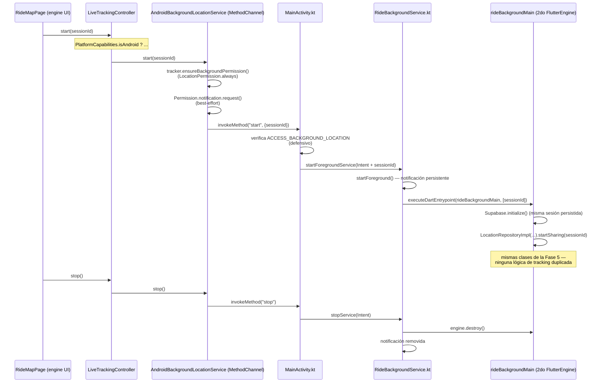

# Sentinel V2 — servicio en background de Android (Fase 6)

Cómo sigue compartiéndose la ubicación de un viaje cuando Sentinel deja de
estar en primer plano en Android. Para el flujo de ubicación en sí
(muestreo, estados de los integrantes, Realtime), ver
[docs/realtime.md](realtime.md); para la arquitectura de capas general,
[docs/architecture.md](architecture.md).

## Decisión: Service nativo, no `geolocator.foregroundNotificationConfig`

`geolocator` (ya usado desde la Fase 5) soporta arrancar un foreground
service con notificación persistente vía
`AndroidSettings(foregroundNotificationConfig: ...)`. Se evaluó y se
descartó para esta fase, explícitamente a pedido del usuario, por una
limitación documentada en el propio paquete:

> Using this foreground notification does not run your service in the
> background, it just increases the priority of your activity making it
> less likely for Android to kill the activity when switching between
> apps. It does not prevent Android from killing the activity.

Es decir: protege el proceso de que el sistema lo mate por presión de
memoria, pero **no sobrevive a que el usuario cierre la app deslizándola
en Recientes** — el tracking sigue atado al ciclo de vida de la Activity.
Para un producto de seguridad donde "el rider guardó el teléfono en el
bolsillo durante 40 minutos" es el caso de uso principal, y donde un swipe
accidental en Recientes no debería cortar silenciosamente la protección,
se optó por la alternativa más robusta: un `Service` Android nativo
(`RideBackgroundService`) declarado con `android:stopWithTask="false"` y
un `onTaskRemoved` que deliberadamente no hace nada — ver el comentario en
`RideBackgroundService.kt` para el razonamiento completo, incluyendo el
trade-off de producto (¿debería un swipe detener el compartir? se decidió
que no, ya que el usuario ya dio consentimiento explícito al tocar
"Compartir mi ubicación").

Costo de esta elección: bastante más código nuevo (Kotlin nativo, un
segundo `FlutterEngine`) que simplemente pasar una config a `geolocator`.
Se evaluaron también `flutter_background_service` (paquete de terceros,
nueva dependencia externa) y se descartaron ambos en favor de esta
implementación propia, más alineada con el resto del proyecto (mínimas
dependencias, control total sobre el ciclo de vida).

## Arquitectura

Piezas:

- **`BackgroundLocationService`** (`domain/repositories/`): interfaz que
  controla remotamente al Service — `start`/`stop`/`isRunning`. Deliberadamente
  **no** una segunda implementación de `LocationRepository`: ese
  compartir ocurre en un proceso/isolate que este lado no puede referenciar
  directamente (ver el doc comment de la interfaz).
- **`AndroidBackgroundLocationService`** (`data/datasources/`): el
  `MethodChannel` (`com.sentinel.app/background_location`). Antes de
  invocar al canal, pide el permiso de ubicación "todo el tiempo" (ver
  `LocationTracker.ensureBackgroundPermission`, distinto de
  `ensurePermission` — una foreground service sin Activity visible no
  cuenta como "en uso" para el sistema de permisos de Android desde la
  API 29) y, best-effort, el de notificaciones.
- **`lib/background/ride_background_main.dart`**: el entrypoint del
  segundo `FlutterEngine`. Reconstruye a mano (sin Riverpod — no hay árbol
  de widgets en un engine headless) exactamente las mismas clases de la
  Fase 5: `GeolocatorLocationTracker`, `LiveLocationRepositoryImpl`,
  `LocationRepositoryImpl`. **Debe estar importado desde algún archivo
  alcanzable por `main.dart`** (lo está, desde el propio `main.dart`, con
  `// ignore: unused_import`) — si no, el compilador nunca lo incluye en
  el kernel compilado y la búsqueda nativa por URI de librería falla en
  runtime (bug real encontrado durante la verificación E2E de esta fase,
  ver más abajo).
- **`RideBackgroundService.kt`**: no hace ubicación ni red por sí mismo —
  solo `startForeground()` + arrancar/destruir el `FlutterEngine` de
  background. `onTaskRemoved` es un no-op intencional (ver arriba).
  `START_STICKY` sin lógica de resumen tras un kill del proceso — ver
  deuda técnica.
- **`MainActivity.kt`**: registra el `MethodChannel` y hace una segunda
  verificación de permiso (defensiva; la primaria ocurre en
  `AndroidBackgroundLocationService.start`, del lado Dart).

## Sesión compartida entre dos engines, sin pasar tokens

El engine de background llama a `Supabase.initialize()` de forma
independiente — no hereda nada del engine de UI (cada `FlutterEngine` es
un runtime Dart separado, aunque ambos corran en el mismo proceso Android).
Lo que sí comparten es el almacenamiento local (`SharedPreferences`) donde
`supabase_flutter` persiste la sesión — por eso el engine de background
recupera el mismo usuario autenticado sin que ningún token cruce el
`MethodChannel`. Si `authRepository.currentUser` da `null` ahí (sesión
cerrada entre que se pidió compartir y que el engine termina de
inicializar), `rideBackgroundMain` registra el error y no comparte nada —
ver deuda técnica sobre la ausencia de una señal de vuelta hacia la UI en
ese caso.

## Verificación end-to-end (dispositivo real: emulador Pixel 6 API 34)

Verificado con comandos reales contra el emulador (`adb`, `uiautomator
dump` para ubicar elementos con precisión, `dumpsys` para inspeccionar el
Service/las notificaciones) y contra Supabase local — no solo lectura de
código:

1. Compartir ubicación con solo el permiso "while in use": rechazado
   correctamente antes de tocar el canal nativo, con el mensaje pidiendo
   "todo el tiempo".
2. Concedido "Allow all the time" desde Ajustes → compartir arranca:
   `RideBackgroundService` en `dumpsys activity services`, notificación
   persistente en `dumpsys notification`.
3. Fila fresca en `live_locations` escrita por el engine de background
   (no por el de UI).
4. App enviada a segundo plano (Home) — `adb emu geo fix` con nuevas
   coordenadas dos veces seguidas, cada una reflejada en `live_locations`
   en segundos, con la app fuera de primer plano todo el tiempo.
5. Tarea removida de Recientes (accidentalmente, mientras se probaba el
   gesto de swipe) — el proceso **no** murió:
   `RideBackgroundService`'s `createTime` en `dumpsys` se mantuvo sin
   cambios (corriendo hace más de 6 minutos) a través del evento, la app
   se reabrió con sesión persistida y el servicio seguía activo.
6. "Dejar de compartir" desde la UI reabierta → `RideBackgroundService`
   desaparece de `dumpsys activity services` y la notificación de
   `dumpsys notification` desaparece — apagado limpio confirmado.

Dos bugs reales aparecieron y se corrigieron durante esta verificación
(ninguno visible por lectura de código ni en los tests unitarios, que
mockean el canal):

1. **`Dart_LookupLibrary: library 'package:sentinel_v2/background/ride_background_main.dart' not found`**
   — el archivo del entrypoint nunca estaba en el grafo de imports
   alcanzable desde `main.dart`, así que el compilador simplemente no lo
   incluía en el kernel compilado. El `@pragma('vm:entry-point')` en la
   función no alcanza por sí solo: hace falta además que algo la
   referencie. Corregido con un `import` (con `// ignore: unused_import`)
   en `lib/main.dart`, documentado ahí mismo para que no se borre "por
   parecer no usado".
2. **Notificación nunca visible**: `POST_NOTIFICATIONS` (API 33+) nunca se
   pedía en runtime — el manifest lo declara, pero declarar no alcanza,
   Android igual requiere el permiso en runtime. `startForeground()`
   funcionaba igual (confirmado: el Service seguía activo y compartiendo),
   solo la notificación quedaba silenciosamente sin mostrarse
   (`dumpsys notification` mostraba `numEnqueuedByApp=1,
   numPostedByApp=0`). Corregido pidiendo el permiso (best-effort, vía
   `permission_handler`, ya dependencia del proyecto) en
   `AndroidBackgroundLocationService.start`, antes de invocar el canal.

## Deuda técnica

- **Sin recuperación automática tras un kill de proceso por memoria**:
  `RideBackgroundService` devuelve `START_STICKY`, pero el `Intent` de
  reinicio que entrega el sistema no trae el `sessionId` (no hay extras en
  un restart automático) — el guard actual simplemente hace `stopSelf()`
  en ese caso. Para sobrevivir un kill real habría que persistir
  `sessionId` (`SharedPreferences`) al arrancar y leerlo de vuelta si
  `onStartCommand` llega con `intent == null`. No implementado: el kill
  por memoria del proceso completo mientras el Service está en foreground
  es el escenario que Android menos probablemente dispara (los foreground
  services son justamente lo que más protege de esto), así que el riesgo
  real es bajo comparado con la complejidad de manejarlo bien.
- **Sin señal de fallo desde el engine de background hacia la UI**: si
  `rideBackgroundMain` falla después de que `start()` ya devolvió éxito
  (p. ej. la sesión de Supabase expiró justo en ese momento, o
  `startSharing` lanza), la UI no se entera — solo queda un log. La
  próxima vez que el usuario abra el mapa vería a los demás sin verse a sí
  mismo compartiendo, sin un mensaje de error explícito. Cerrar este hueco
  necesitaría un canal en la dirección opuesta (background → UI), no
  implementado en esta fase.
- **`RideMapPage._isSharing` no se sincroniza con el Service real al
  reabrir la app**: es estado local del widget, inicializado siempre en
  `false`. Si el Service ya estaba compartiendo (p. ej. la app se cerró y
  se reabrió mientras un viaje seguía compartiéndose en background), el
  FAB muestra "Compartir mi ubicación" en vez de "Dejar de compartir"
  hasta que el usuario lo toca — tocarlo no rompe nada (reinicia el mismo
  engine de background de forma idempotente, confirmado en la
  verificación), pero el label queda momentáneamente incorrecto. El
  arreglo correcto es consultar `BackgroundLocationService.isRunning()` en
  `initState` (Android) antes de decidir el valor inicial — no
  implementado en esta fase.
- **Prominent disclosure de Play Store**: `ACCESS_BACKGROUND_LOCATION` en
  producción requiere, por política de Google Play (no por API de
  Android), una pantalla propia explicando el uso de ubicación en
  background antes del primer pedido del permiso del sistema. No
  implementada — este proyecto está en fase de desarrollo local, no de
  publicación.
- **Verificación del escenario "swipe manual desde Recientes" no
  reproducida por gesto de UI en esta sesión**: `adb shell input swipe`
  no logró simular de forma confiable el gesto de descarte de tarjeta en
  el launcher del emulador (limitación de automatización, no del código).
  Sí se observó indirectamente que el proceso sobrevivió una remoción de
  tarea real (ver el punto 5 de la verificación arriba) — la garantía
  descansa en `android:stopWithTask="false"` + `onTaskRemoved` vacío,
  mecanismos estándar de Android, pero vale la pena repetir la prueba con
  un gesto manual real en un dispositivo antes de confiar en esto para
  producción.
