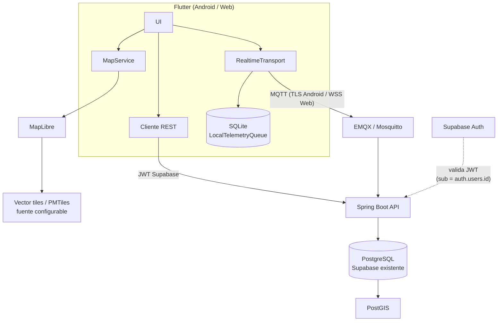

# Sentinel V2 — migración a MapLibre + MQTT + Spring Boot/PostGIS

**Fase 0 (auditoría) de la iniciativa "Realtime V2".** Este documento es el
resultado de inspeccionar el repositorio completo antes de tocar código —
qué existe hoy, qué se conserva, qué se reemplaza, qué se migra y qué es
nuevo, más los riesgos de la migración. Las fases siguientes (A→O, ver
"Plan de fases" al final) se implementan una por una sobre esta base, sin
romper lo que ya funciona.

## Resultado del preflight (Fase 0)

```
git status        → 0 commits, todo untracked (sin cambios desde la última sesión)
flutter --version → 3.47.1 (stable), Dart 3.13.1
dart format .     → 199 archivos, 0 cambios
flutter analyze   → No issues found
flutter test      → 253/253 verdes
```

Supabase local (Docker) no estaba levantado al momento de esta auditoría —
no bloquea la Fase 0 (se leyeron las migraciones directamente), pero hace
falta arriba para las fases que toquen PostGIS/pgTAP.

## Arquitectura actual (auditada, no supuesta)

### Identidad

**`auth.users.id` (UUID de Supabase Auth) es la única identidad de usuario
en todo el sistema, hoy.** `AppUser.id` (`lib/features/auth/domain/entities/app_user.dart`)
es una proyección delgada de `supabase_flutter`'s `User.id` — nunca se
genera un segundo id en Flutter. Cada tabla que referencia a un usuario
(`ride_group_members.user_id`, `ride_session_members.user_id`,
`live_locations.user_id`, `accident_events.user_id`, `device_push_tokens.user_id`, …)
es una FK directa a `auth.users(id)`. **Este documento no propone tocar
esto** — es exactamente la restricción dura que pediste, y ya es así.

### Módulos existentes, por nombre

| Módulo pedido | Existe hoy como | Estado |
|---|---|---|
| `groups` | `features/groups/` — `ride_groups`/`ride_group_members`, RPC `create_ride_group`/`join_group_by_code`/`leave_group` | Completo (Fase 3) |
| `rides` | `features/rides/` — `ride_sessions`/`ride_session_members`, RPC `start_ride_session`/`finish_ride_session` | Completo (Fase 4) |
| `location` | `features/rides/domain/{repositories,services}` — `LocationTracker`, `LocationSamplingPolicy`, `LocationRepository`, `LiveLocationRepository` | Completo (Fase 5), **transporte realtime = Supabase Realtime**, no MQTT |
| `maps` | `features/rides/presentation/{pages/ride_map_page.dart,utils/member_markers.dart}` | Completo (Fase 5), **motor = `google_maps_flutter`**, no MapLibre, sin abstracción `MapService` |
| `accident_detection` | `features/accidents/` — `AccidentDetectionService` (heurística), `AccidentMonitorServiceImpl` (máquina de estados) | Completo (Fase 7), **no tocar** |
| `alerts` | `features/push_tokens/` + `supabase/functions/dispatch-accident-alerts/` (Deno) | Completo (Fase 8), **no tocar** |

Ningún módulo de `groups`/`rides`/`accident_detection`/`alerts` se
reimplementa en esta migración — la migración es específicamente de
**transporte de ubicación en tiempo real** y **motor de mapas**, más
capacidades nuevas (offline, rezagados vía PostGIS, SOS) que hoy no
existen en absoluto.

### `live_locations` / `location_history` (esquema real, `supabase/migrations/20260827210006_locations.sql`)

```sql
create table public.live_locations (
  session_id uuid not null references public.ride_sessions (id) on delete cascade,
  user_id uuid not null references auth.users (id) on delete cascade,
  latitude double precision not null,
  longitude double precision not null,
  accuracy real, speed real, heading real, battery_level smallint,
  recorded_at timestamptz not null default now(),
  primary key (session_id, user_id)
);
```

- **No hay `geography(Point,4326)`, no hay PostGIS, no hay índice GiST.**
  Lat/lng son `double precision` sueltos.
- La columna es **`session_id`, no `ride_session_id`** — la nueva
  arquitectura debe usar el nombre real de columna, no el del enunciado.
- Una fila por `(session_id, user_id)` vía `upsert(...,
  onConflict: 'session_id,user_id')` — ya es "una posición actual por
  participante", como pide la nueva arquitectura; solo falta el tipo
  `geography` y el índice espacial.
- `location_history` es append-only, mismo esquema de columnas planas,
  sin `sequence`, sin `client_recorded_at`/`server_received_at` (solo
  `recorded_at`), sin `message_id`. Tiene un `TODO(retention)` pendiente
  desde la Fase 5 (sin purga todavía).
- Transporte: **Supabase Realtime** (`postgres_changes` sobre
  `live_locations`, canal `live_locations:$sessionId`), implementado en
  `SupabaseLiveLocationRemoteDataSource.watchLocationChanges` — ver código
  completo más abajo, es la pieza que `RealtimeTransport` va a abstraer.

### Ubicación — pipeline cliente actual

```
Geolocator (GeolocatorLocationTracker)
  → LocationSamplingPolicy (minInterval=20s, minDistanceMeters=25, minHeadingChangeDegrees=35)
    → LocationRepositoryImpl
      → upsert en live_locations (cada fix, sin muestreo)
      → insert en location_history (solo si LocationSamplingPolicy.shouldRecord)
```

Importante: **`LocationSamplingPolicy` ya existe pero es un intervalo
fijo**, no adaptativo (no distingue "en movimiento" de "detenido" como
pide `LocationSamplingConfig`). Ese es trabajo nuevo, no una migración.

No hay cola offline — sin conexión, `upsertMyLocation`/`recordHistory`
simplemente fallan (no hay `LocalTelemetryQueue`, no hay SQLite, no hay
`sqflite`/`drift` en `pubspec.yaml`).

### Rezagados — ya existe, 100% cliente, sin PostGIS

`MemberTrackingService` + `CentroidStragglerDetectionStrategy`
(`features/rides/domain/services/`) ya calculan estados por miembro:

```dart
enum MemberTrackingStatus { active, stale, lagging, offline, possibleIncident }
```

con umbrales centralizados en `MemberTrackingConfig`
(`maxDistanceFromGroupMeters=500`, `staleLocationSeconds=45`,
`offlineLocationSeconds=180`) — el **mismo concepto** que
`LaggingDetectionService`/`laggingDistanceMeters`/`staleAfterSeconds` de
la nueva arquitectura, pero:
- la distancia se calcula con Haversine manual en Dart
  (`core/utils/geo_math.dart`), no `ST_Distance`/`ST_DWithin` de PostGiS;
- la referencia es el **centroide** del grupo, no un líder designado;
- no hay grace period ni hysteresis — el estado se recalcula puro en cada
  frame de datos, sin memoria temporal;
- no existe tabla `lagging_events` — el estado vive solo en memoria de la
  UI, nunca se persiste ni se notifica al grupo.

Este servicio **sigue vivo tal cual** durante toda la migración — es el
fallback offline/cliente que la nueva arquitectura server-side (PostGIS)
complementa, no reemplaza de entrada.

### Background Android

`RideBackgroundService` (Kotlin, foreground service) + un segundo
`FlutterEngine` headless (`lib/background/ride_background_main.dart`) que
reconstruye las mismas clases `LocationRepositoryImpl`/etc. del foreground
— cero lógica duplicada entre los dos caminos. Esto es exactamente la
pieza que debe seguir funcionando idéntica cuando el transporte cambie de
Supabase Realtime a MQTT: el cambio ocurre detrás de
`LiveLocationRepository`/el futuro `RealtimeTransport`, ninguno de los dos
engines necesita enterarse de cuál transporte está activo.

### Mapas

`google_maps_flutter` directo — `RideMapPage` usa `GoogleMap` y
`member_markers.dart` mapea `MemberLocation` → `Marker` de Google Maps sin
ninguna capa de abstracción propia (`buildMemberMarkers` es una función
pura, pero acoplada al tipo `Marker` del plugin). No existe `MapService`,
no existen `MapCoordinate`/`MapMarker`/`MapRoute`/`MapViewport`, no existe
`MapTileConfig`, no existe nada de offline maps.

### Qué NO existe en absoluto (confirmado por auditoría, no supuesto)

- `maplibre_gl` — no está en `pubspec.yaml`.
- `sqflite`/`drift`/cualquier persistencia SQLite — no está en `pubspec.yaml`.
- `mqtt_client`/cualquier cliente MQTT — no está en `pubspec.yaml`.
- `backend/` (Spring Boot) — no existe el directorio.
- `infra/` (Docker Compose de broker) — no existe el directorio.
- PostGIS — la extensión no está habilitada en ninguna migración
  (`grep CREATE EXTENSION` sobre `supabase/migrations/` no encuentra
  `postgis`).
- Tablas `sos_events`, `lagging_events` — no existen.
- Estado `sos` en `MemberTrackingStatus` — no existe (el más cercano es
  `possibleIncident`, que en realidad corresponde al pipeline de
  `accident_detection`, no a un botón SOS manual).

## Arquitectura nueva (objetivo)



Los tres protocolos, exactamente como pediste: **REST** (CRUD, snapshot
inicial, batch sync, credenciales MQTT), **MQTT** (posición, presencia,
SOS, alertas, telemetría de baja latencia), **PostgreSQL/PostGIS** (fuente
de verdad persistente, geoespacial). SQLite local para offline. MapLibre
desacoplado del proveedor de tiles.

## Qué se conserva (sin tocar)

- **Supabase Auth como única identidad** — `auth.users.id` sigue siendo el
  `sub` del JWT que tanto Flutter como el futuro Spring Boot usan como
  `currentUserId`. Spring Boot **valida** ese JWT (JWKS de Supabase), no
  emite los suyos propios, no crea usuarios propios.
- **`supabase/migrations/` como source of truth del esquema** — Spring
  Boot se configura con `ddl-auto=validate`; ninguna migración Flyway
  nueva convive con las de Supabase. Toda evolución de esquema (PostGIS,
  columnas nuevas, `sos_events`, `lagging_events`) se agrega como
  migraciones `.sql` nuevas en `supabase/migrations/`, igual que las
  fases 1-10 ya hicieron.
- **RLS + RPC `SECURITY DEFINER`** como mecanismo de autorización de datos
  — se mantiene para todo lo que siga siendo REST/Postgrest directo desde
  Flutter (grupos, viajes, historial). El backend Spring Boot es una
  *segunda* puerta de entrada para telemetría/MQTT, no un reemplazo de
  Supabase como base de datos.
- **`accident_detection` y `alerts` (Fases 7-8), intactos.** El plan del
  usuario lo pide explícitamente ("no reimplementar aún todo
  `AccidentDetector`"); la integración futura pasa por una interfaz nueva
  (`EmergencyEventSource`), nunca tocando el detector existente.
- **`google_maps_flutter` sigue funcionando** hasta que `MapLibre` esté
  implementado, probado en Android y Web, y explícitamente aprobado para
  reemplazarlo — no se retira nada a mitad de camino.
- **Supabase Realtime sigue funcionando** para `live_locations` durante
  toda la migración — ver "Estrategia de migración" abajo. No se borra
  código de Realtime como parte de esta fase.

## Qué se reemplaza (gradualmente, nunca de un salto)

| Pieza actual | Reemplazo | Mecanismo de transición |
|---|---|---|
| Transporte realtime de ubicación (`postgres_changes` sobre `live_locations`) | MQTT (EMQX/Mosquitto) | Abstracción `RealtimeTransport` con dos implementaciones (`SupabaseRealtimeTransport` — extraída del código actual sin cambiarlo — y `MqttRealtimeTransport` nueva), seleccionadas por `REALTIME_TRANSPORT=supabase\|mqtt` |
| `google_maps_flutter` | MapLibre (`maplibre_gl`) | Abstracción `MapService`, una sola implementación nueva (`MapLibreMapService`) — no hay "modo dual" de mapas, se cambia una vez validado |
| Rezagados 100% cliente (Haversine + centroide) | `LaggingDetectionService` server-side (PostGIS `ST_Distance`/`ST_DWithin`) | El cliente conserva `MemberTrackingService` como vista local/offline; el servidor pasa a ser la fuente de verdad para el evento persistido (`lagging_events`) y la alerta al grupo |

## Qué se migra (evoluciona el esquema, sin destruir datos)

- `live_locations`: agrega `location geography(Point,4326)` (poblada desde
  `latitude`/`longitude` existentes vía trigger o cómputo en la
  aplicación), `sequence`, `client_recorded_at` (`recorded_at` pasa a
  significar esto exactamente), `server_received_at` nuevo. Se mantiene
  `UNIQUE (session_id, user_id)` — ya existe como PK compuesta.
- `location_history`: mismo tipo de adición (`location geography`,
  `sequence`, `message_id` para idempotencia de batch sync), sin romper
  las columnas que ya usa `RideMapPage`/`location_history` de hoy.
- Índice nuevo: `GiST(location)` en ambas tablas.

## Qué es nuevo (no existía nada de esto)

`backend/` (Spring Boot), `infra/` (Docker Compose del broker MQTT),
`maplibre_gl` + `MapService`/`OfflineMapManager`, `LocalTelemetryQueue`
(SQLite), `sos_events`, `lagging_events`, credenciales MQTT temporales,
topics versionados `sentinel/v1/...`.

## Riesgos

1. **Doble transporte realtime durante la transición.** Mantener
   `SupabaseRealtimeTransport` y `MqttRealtimeTransport` simultáneamente
   (aun detrás de un feature flag) es carga de mantenimiento real, no
   gratis — mitigado por tener un plan explícito de retiro (ver
   "Migración desde Supabase Realtime" en el plan general) en vez de
   dejarlo indefinido.
2. **PostGIS requiere que la extensión esté disponible en la imagen de
   Postgres que usa Supabase local/self-hosted** — no confirmado todavía
   (Docker no estaba arriba durante esta auditoría). Se valida
   explícitamente en la Fase F antes de asumir que `CREATE EXTENSION
   postgis` funciona sin fricción.
3. **MQTT en Flutter Web está limitado a WSS** (el navegador no abre TCP
   arbitrario) — la librería cliente debe soportarlo en ambas plataformas
   sin dos implementaciones separadas; se verifica mantenimiento/versión
   antes de fijarla (Fase H), no se asume de antemano.
4. **Offline maps con fuentes públicas de OSM** — `tile.openstreetmap.org`
   prohíbe bulk download; la Fase D no puede avanzar hasta confirmar que
   la fuente de tiles configurada permite explícitamente
   `offline`/`prefetch` (`MapTileConfig.offlineAllowed`).
5. **No romper el flujo de seguridad ya probado** (login → grupo → viaje
   → ubicación → detección → alerta, con 253 tests verdes hoy) mientras
   se introduce un backend y un protocolo enteramente nuevos — cada fase
   nueva corre `flutter analyze`/`flutter test` (y, cuando aplique, tests
   de backend) antes de avanzar a la siguiente, sin excepciones.
6. **Alcance total es grande** (Spring Boot + MQTT + PostGIS + MapLibre +
   offline-first + SOS + rezagados server-side) — se ejecuta fase por
   fase (A→O), cada una entregable y verificable por separado, nunca como
   un cambio monolítico.

## Plan de fases (orden acordado)

| Fase | Contenido | Estado |
|---|---|---|
| A | Auditoría + este documento | ✅ Hecho |
| B | MapLibre online (reemplaza `google_maps_flutter`) | Pendiente — requiere confirmar versión estable de `maplibre_gl` antes de instalar |
| C | Abstracción `MapService` | Pendiente |
| D | MapLibre offline Android | Pendiente — bloqueado por elegir fuente de tiles que permita offline |
| E | Spring Boot skeleton | Pendiente — requiere confirmar Java instalado |
| F | PostGIS | Pendiente — requiere Supabase local arriba |
| G | Broker MQTT local (`infra/`) | Pendiente |
| H | `RealtimeTransport` Flutter | Pendiente |
| I | Location vía MQTT | Pendiente |
| J | Snapshot inicial REST | Pendiente |
| K | Offline telemetry queue (SQLite) | Pendiente |
| L | Batch synchronization | Pendiente |
| M | `LaggingDetectionService` (PostGIS) | Pendiente |
| N | SOS manual | Pendiente |
| O | Integración con `AccidentDetector` existente | Pendiente |

No se avanza a la fase siguiente si `flutter analyze`, `flutter test` o
los tests de backend fallan, o si el código de la fase actual no
compila — regla explícita, ya aplicada en esta sesión para las fases 1-10
anteriores del proyecto.

## Siguiente paso recomendado

**Fase B — MapLibre online.** Antes de instalar `maplibre_gl` hay que
confirmar la versión estable compatible con Flutter 3.47.1/Dart 3.13.1
contra pub.dev (no inventar el número), y decidir con vos la fuente de
tiles inicial para desarrollo (`MapTileConfig`) ya que **no se puede usar
`tile.openstreetmap.org` para nada que implique offline/bulk download**,
y el reemplazo de `google_maps_flutter` es la primera pieza de esta
migración que toca una pantalla ya funcionando y probada
(`RideMapPage`) — por eso se confirma antes de tocarla, no después.
