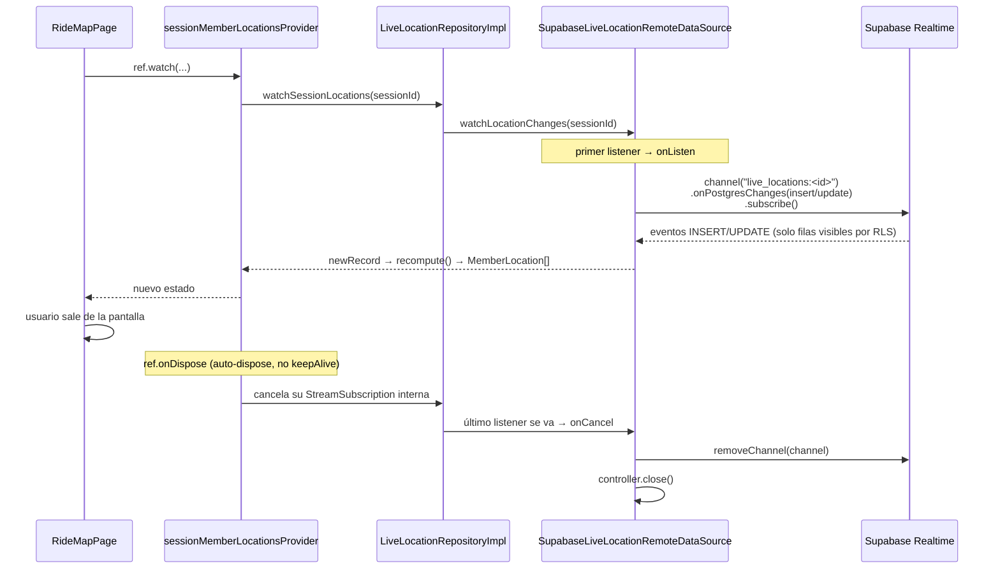

# Sentinel V2 — Realtime (ubicación en vivo)

Cómo se usa Supabase Realtime en la Fase 5 (`live_locations`) y cómo se
relaciona con el canal privado `ride:<session_id>` migrado en la Fase 3/4.
Para el esquema y las políticas de Realtime a nivel de base de datos, ver
[docs/database.md#realtime](database.md#realtime); para la arquitectura de
capas, [docs/architecture.md](architecture.md).

## Dos mecanismos de Realtime distintos en este proyecto

Supabase expone dos formas de Realtime, y **este proyecto usa ambas para
cosas distintas** — no son intercambiables:

| | `postgres_changes` (usado en Fase 5) | Realtime Authorization / broadcast privado (`ride:<session_id>`, migrado en Fase 3, **sin consumir todavía**) |
|---|---|---|
| Qué transmite | filas reales insertadas/actualizadas en una tabla | mensajes efímeros arbitrarios (no filas de tabla) |
| Seguridad | automática: Realtime evalúa la RLS de la tabla contra el usuario autenticado del socket — si su policy de `select` no lo dejaría leer la fila, no la recibe | manual: políticas RLS sobre `realtime.messages`, filtrando por `realtime.topic()`; el cliente debe abrir el canal con `private: true` |
| Uso actual | `SupabaseLiveLocationRemoteDataSource.watchLocationChanges` — inserts/updates de `live_locations` filtrados por `session_id` | ninguno — reservado para eventos sin fila propia ("fulano se desconectó", presencia, o el broadcast de alerta de accidente de la Fase 8) |

`live_locations` ya está en la publicación `supabase_realtime` (migración
`20260827210006_locations.sql`), así que basta con `onPostgresChanges` +
las policies existentes — no hace falta el canal privado para esta
feature. Si una fase futura necesita difundir algo que **no** es una fila
de tabla (p. ej. "Bruno se desconectó voluntariamente" sin escribir nada en
`live_locations`), ese es el caso para el que existe `ride:<session_id>`.

## Estrategia de canal: uno por sesión, creado bajo demanda

`SupabaseLiveLocationRemoteDataSource.watchLocationChanges(sessionId)`
(`lib/features/rides/data/datasources/live_location_remote_datasource.dart`)
no abre el canal al llamarse — devuelve un `Stream` respaldado por un
`StreamController.broadcast` cuyo `onListen`/`onCancel` son los que
realmente crean/destruyen el `RealtimeChannel`:

Nombre del canal: `live_locations:$sessionId` — un canal por sesión de
viaje, no uno global. Dos pantallas de mapa abiertas para la misma sesión
comparten el mismo `RealtimeChannel` porque el `StreamController` es
`broadcast`: el segundo listener no dispara un segundo `onListen` (no hay
doble suscripción), y el canal solo se destruye cuando el **último**
listener cancela.

## Disciplina de suscripción/cancelación

La regla dura del proyecto — "nunca dejar un canal Realtime vivo más
tiempo del que la pantalla que lo pidió está abierta" — se cumple aquí sin
código de limpieza manual en el widget, apoyándose en el propio ciclo de
vida de Riverpod:

- `sessionMemberLocationsProvider` (`presentation/controllers/live_tracking_controller.dart`)
  es **`@riverpod`**, no `@Riverpod(keepAlive: true)` — cuando
  `RideMapPage` dejar de observarlo (se hace `pop`), Riverpod dispara
  `ref.onDispose`, que cancela la `StreamSubscription` interna sobre
  `watchSessionLocations(...)`.
- Esa cancelación es la que hace bajar a cero el contador de listeners del
  `StreamController.broadcast` de la fuente de datos, disparando su
  `onCancel` → `removeChannel` + `controller.close()`.
- Verificado con un test explícito de este camino completo
  (`test/features/rides/presentation/controllers/live_tracking_controller_test.dart`,
  *"stops updating once disposed (Realtime subscription released)"*): un
  fake con contador de listeners confirma que, tras `container.dispose()`,
  el contador vuelve a `0` — no solo que "no explota al emitir después",
  que hubiera pasado igual con una suscripción filtrada y no habría
  probado nada.

`LiveTrackingController` (la acción de "compartir mi ubicación") tiene su
propio `ref.onDispose` independiente para detener el `LocationTracker` del
dispositivo (`geolocator`) si la pantalla se cierra mientras se estaba
compartiendo — ver el comentario en
`lib/features/rides/presentation/controllers/live_tracking_controller.dart`
sobre por qué ese `onDispose` lee el repositorio **durante `build()`** y no
dentro del propio callback (Riverpod prohíbe `ref.read` una vez que el
callback de disposal ya está corriendo).

## El ticker de 10s: por qué hace falta además de Realtime

`sessionMemberLocations` combina el stream de Realtime con un
`Timer.periodic(10s)` que vuelve a calcular los estados
(`MemberTrackingService.computeStatuses`) sin esperar un evento nuevo.
Motivo: un estado puede cambiar solo por el paso del tiempo — `active` →
`stale` → `offline` — incluso cuando nadie manda una fila nueva (el rider
se quedó sin señal, cerró la pestaña, etc.). Sin el ticker, alguien que
simplemente dejó de enviar ubicaciones se vería "activo" para siempre,
porque Realtime nunca entrega un evento por *ausencia* de eventos.

## Reconexión

El cliente `supabase_flutter`/Realtime maneja la reconexión de socket
(WebSocket) automáticamente — reintentos con backoff y re-`subscribe()` de
los canales activos tras una caída de red breve. Esto no está probado con
un test propio en esta fase (requeriría simular una desconexión de socket,
no solo de HTTP). Dos cosas mitigan el hueco de datos mientras el socket
está caído:

- `watchSessionLocations` (`LiveLocationRepositoryImpl`) hace un
  `fetchCurrentLocations` inicial vía REST **cada vez que el provider se
  reconstruye** (p. ej. al volver a entrar a la pantalla del mapa), así que
  un usuario que perdió eventos mientras el canal estaba caído los
  recupera al re-entrar, aunque no en caliente mientras la pantalla sigue
  abierta.
- El ticker de 10s sigue corriendo con los datos que ya tiene, así que un
  corte de socket degrada el estado a "más viejo de lo real" gradualmente
  (vía el cálculo de staleness) en vez de mostrar algo incorrecto
  silenciosamente.

**Deuda técnica**: no hay recuperación activa de eventos perdidos durante
un corte largo mientras la pantalla del mapa permanece abierta (sin volver
a entrar a ella). Aceptable para esta fase: la ventana de riesgo es corta
(Realtime reconecta solo) y `live_locations` es el estado *actual*, no un
log — el próximo evento que sí llegue ya trae la posición correcta.

## Verificación end-to-end (manual, este documento)

Verificado contra Supabase local con dos sesiones de navegador
autenticadas como usuarios distintos (`rider1@sentinel.dev` observando,
`rider2@sentinel.dev` compartiendo ubicación): al activar "Compartir mi
ubicación" en la sesión de `rider2`, la fila de `rider2` en el roster de la
sesión de `rider1` cambió de *"Sin conexión"* a *"Activo"* **sin recargar
la página**, confirmando que el evento de `postgres_changes` viaja por el
canal `live_locations:<session_id>` y llega a un cliente distinto del que
escribió. Dos bugs reales aparecieron y se corrigieron durante esta
verificación (no visibles en los tests unitarios porque ninguno ejercita
la ruta real cliente → Postgres → cliente):

1. **`recordHistory` mandaba `battery_level`** (parte de
   `LocationFix.toJson()`) a `location_history`, tabla que no tiene esa
   columna — PostgREST devolvía 400 en cada muestra. Corregido quitando
   esa clave antes del insert
   (`SupabaseLiveLocationRemoteDataSource.recordHistory`).
2. **`GeolocatorLocationTracker` no normalizaba `position.timestamp` a
   UTC**. `LocationFix.toJson()` serializa con
   `DateTime.toIso8601String()`, que omite el offset por completo para un
   `DateTime` no-UTC — Postgres interpretó una hora local (Bolivia, UTC-4)
   como si ya fuera UTC, guardando cada fix ~4 horas "en el pasado".
   Confirmado en vivo (una fila recién escrita mostraba `age` de ~4h en
   vez de segundos) y corregido con `.toUtc()` en el único punto donde una
   `DateTime` de plataforma entra al dominio. Sin este fix,
   `MemberTrackingService` habría clasificado como `offline` a cualquier
   rider fuera de UTC+0 apenas unos segundos después de compartir su
   ubicación.
