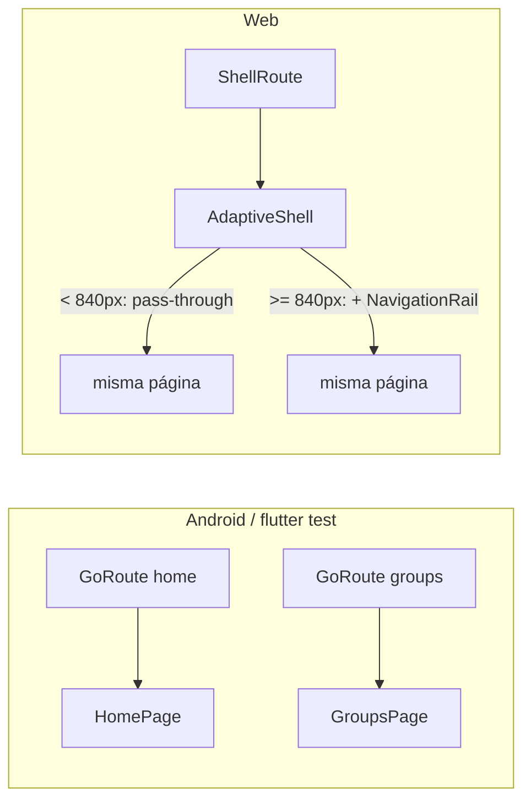

# Sentinel V2 — dashboard responsive de Web (Fase 10)

Última fase del alcance original del proyecto. No agrega funcionalidad
nueva — todo lo que corre en Web ya corría (Fase 1–9 nunca excluyeron Web
salvo lo explícitamente Android-only vía `PlatformCapabilities`, ver
`docs/architecture.md`). Lo que faltaba era que el *layout* dejara de ser
literalmente el mismo stack de pantalla completa de un teléfono estirado
sobre una ventana de escritorio.

## Qué NO es esta fase

No es una segunda app. No hay pantallas nuevas, no hay una "vista de
administración" separada de las que ya existen — son las mismas
`GroupsPage`/`VehiclesPage`/`EmergencyContactsPage`/`HistoryPage`/
`HomePage`, con más espacio alrededor cuando el viewport lo permite. No se
tocó ninguna lógica de negocio, ningún repositorio, ninguna tabla.

## Dos piezas, ortogonales entre sí

### 1. `AdaptiveShell` — navegación lateral persistente, solo Web

`app/router.dart` tiene el único `if (PlatformCapabilities.isWeb)` de toda
la fase: decide si las cinco pantallas "hub" (Inicio, Grupos, Vehículos,
Contactos de emergencia, Historial) se envuelven en un `ShellRoute` de
go_router cuyo `builder` es `AdaptiveShell(child: child)`.

`AdaptiveShell` en sí mismo no vuelve a preguntar la plataforma — solo
mira `MediaQuery.sizeOf(context).width` contra un único breakpoint
(`AdaptiveShell.railBreakpoint`, 840px, del mismo orden que el "medium" de
Material 3, sin implementar el sistema completo de breakpoints hasta que
un segundo número lo justifique). Por debajo del breakpoint, incluso en
Web, `AdaptiveShell` es un passthrough — devuelve `child` sin envolver
nada. Por encima, agrega un `Scaffold` con un `NavigationRail` a la
izquierda y `child` a la derecha.

Punto importante: **cada página sigue siendo dueña de su propio
`Scaffold`/`AppBar`** — `HomePage` conserva sus iconos de perfil/cerrar
sesión, `GroupsPage` conserva su FAB, etc. `AdaptiveShell` no reemplaza
ese chrome, solo le pone al lado la navegación persistente. Esto significa
que hay un `Scaffold` anidado dentro de otro `Scaffold` cuando el rail está
visible — deliberado y sin problema en Flutter, y evita reescribir cinco
páginas para que dejen de tener su propio `Scaffold`.

Navegar entre destinos del rail usa `context.go(...)`, no `context.push`
— cambiar de sección en un dashboard reemplaza la ubicación, no apila una
pantalla encima de otra (eso sigue siendo `context.push` para las páginas
de detalle: `GroupDetailPage`, `RideSessionPage`, `AccidentDetailPage`, …,
que además viven **fuera** del `ShellRoute` a propósito — entrar al
detalle de un grupo no tiene por qué mantener la rail, es una inmersión).

### 2. `ResponsiveContent` — ancho máximo centrado, cualquier plataforma

`shared/widgets/responsive_content.dart` limita y centra el contenido de
las listas (`GroupsPage`, `VehiclesPage`, `EmergencyContactsPage`, los
tres tabs de `HistoryPage`) una vez que el viewport supera su `maxWidth`
(900px por defecto) — el mismo problema que ya resolvía `ProfilePage` a
mano con `Center(child: ConstrainedBox(maxWidth: 400))`, generalizado a
las pantallas de lista.

A diferencia de `AdaptiveShell`, `ResponsiveContent` **no pregunta
plataforma en absoluto** — es puro `MediaQuery`, así que es exactamente el
mismo widget en Android, Web angosto y Web ancho; simplemente nunca se
activa por debajo de su `maxWidth`. No hay una segunda razón para que esto
sea Web-only: una tablet Android ancha se beneficia igual, y no cuesta
nada dejarlo así.

## Por qué no un layout multi-columna de verdad

Un dashboard "de verdad" (dos o tres columnas de contenido simultáneo,
p. ej. lista de grupos + detalle del grupo seleccionado lado a lado) es un
rediseño de cada pantalla, no un ajuste de ancho — se evaluó y se
descartó para esta fase: ninguna de las cinco pantallas hub tiene hoy un
"maestro-detalle" natural que lo justifique (Historial es tabs, no
maestro-detalle; Grupos es una lista simple). Candidato real si el
producto crece en esa dirección — ver deuda técnica.

## Qué se verificó

- Los cinco `GoRoute` "hub" siguen siendo *exactamente* los mismos objetos
  en ambas ramas (`if (PlatformCapabilities.isWeb) ShellRoute(...) else
  ...hubRoutes`) — no hay una segunda definición que pueda divergir de la
  primera.
- `flutter test` corre como Android por defecto (`PlatformCapabilities.isWeb`
  es `false`), así que la suite completa (244 tests) nunca ejercita el
  `ShellRoute` — cero riesgo de que esta fase haya tocado el camino
  Android ya probado. `AdaptiveShell`/`ResponsiveContent` tienen sus
  propios widget tests, pumpeados directamente (sin pasar por
  `PlatformCapabilities`) variando `tester.view.physicalSize`.
- `flutter build web --dart-define-from-file=config/dev.json` real,
  release, no solo `flutter analyze` — la primera vez que este repo
  ejercita un build de Web completo.

## Deuda técnica

- **Sin layout maestro-detalle de verdad** — ver "Por qué no un layout
  multi-columna" arriba.
- **`AdaptiveShell` no persiste qué tan ancha dejó el usuario la ventana**
  entre sesiones — no hace falta hoy (el breakpoint ya reacciona a un
  resize en vivo), pero si en el futuro se agrega una preferencia de
  "siempre mostrar/ocultar la rail", este es el lugar.
- **Vista de administración de grupo pensada para pantalla ancha**
  (roster completo, estado de cada viaje, en vez de la lista simple
  actual) — candidato natural para cuando/si se justifica el
  maestro-detalle de arriba.
